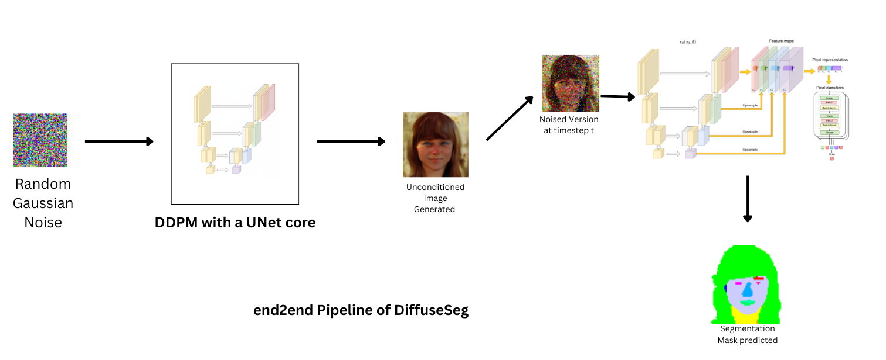
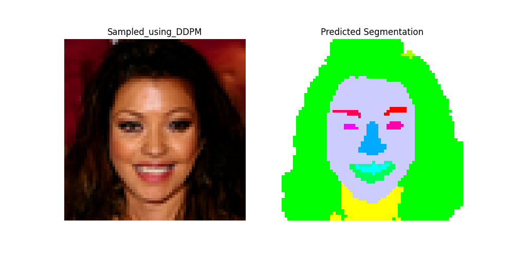
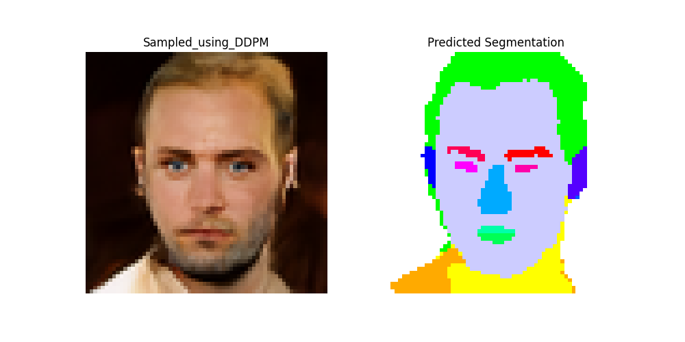
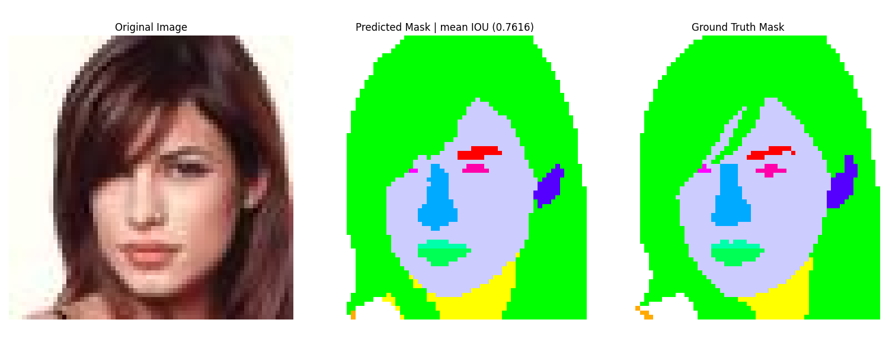
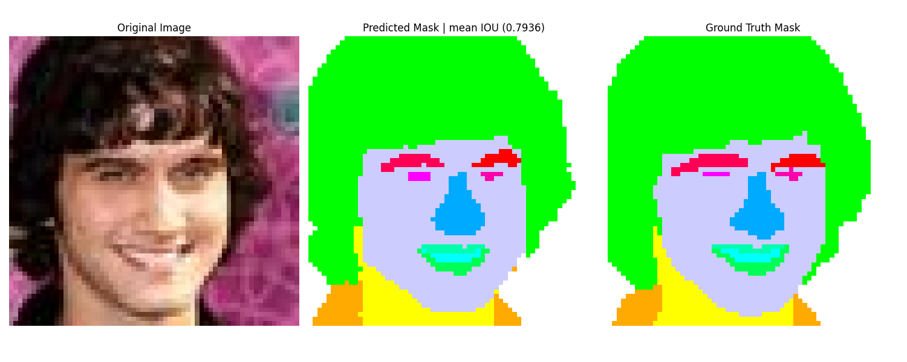

# DiffuseSeg: Synthetic Data and Segmentation from a Single Diffusion Model

DiffuseSeg demonstrates how a single, unconditionally trained Denoising Diffusion Probabilistic Model (DDPM) can serve as a powerful backbone for both high fidelity synthetic image generation and label-efficient semantic segmentation.

The core idea is to repurpose the rich, multi-scale features learned by the U-Net decoder of a DDPM. By extracting these features, we can train a lightweight, pixel level segmentation head with very few labeled examples, effectively turning the generative model into a labeled data factory.

This project was inspired by the following [paper](https://arxiv.org/abs/2112.03126).
### Key Features
- **End-to-End Pipeline:** Train a DDPM on unlabeled images and then use it to generate paired synthetic images and segmentation masks.
- **Label-Efficient:** The segmentation head requires very little annotated data for decent enough results (mIOU > 0.35) (trained on as few as 100 labeled images).
- **High-Quality Synthesis:** Generates realistic 64x64 face images.
- **Data Augmentation:** Easily create large-scale synthetic datasets with perfect pixel-level annotations for downstream tasks.

### How It Works: The TwoStage Pipeline
The project is implemented in two main stages:

#### Stage 1: Train a Denoising Diffusion Model (DDPM)
- An unconditional DDPM with a U-Net core is trained from scratch on a dataset of unlabeled face images (CelebA-HQ 64x64).This model learns to reverse a diffusion process, progressively transforming Gaussian noise into a realistic face image.
- One can use the scripts from here to train on any dataset with minor dataset specific modifications.
- You can also use a pre-trained model and directly move to stage2.



#### Stage 2: Train a Segmentation Head
With the DDPM U-Net frozen, we use it as a feature extractor.

- **Feature Extraction:** For a given image (real or synthetic), we extract activations from specific decoder blocks of the U-Net at certain timesteps (e.g., t=50, 150, 250). The specific blocks(all upblocks) and timesteps(50,150,250) chosen by me were motivated by the paper and my architecture choices.
- **Pixel Descriptors:** These multi scale feature maps are upsampled and concatenated to form a single, rich feature vector for every pixel.
- **MLP Training:** An ensemble of small, pixel-wise Multi-Layer Perceptrons (MLPs) is trained on a small set of labeled images to classify each pixel feature vector into one of the semantic classes (e.g., hair, skin, nose).


This approach allows the model to generate a segmentation mask for any image—real or synthetically generated by the DDPM.

### Results
The segmentation head achieves strong performance on the CelebA-HQ validation set, demonstrating the quality of the features extracted from the trained DDPM.

<!-- | Dataset | mIoU (%) | Notes |
| :--- | :---: | :--- |
| CelebAHQ64 Validation | 76.45 | [cite_start]Trained on only 100 labeled images[cite: 230]. | -->

#### Example Predictions
Here are some end-to-end results, showing a synthetic image generated by the DDPM and the corresponding segmentation map produced by the MLP head.




Here are some validation results, showing a image, its GT Mask from the CelebA-HQ Dataset accompanied by the corresponding segmentation map produced by DiffuseSeg.




### Trained weights and demo :
- **Colab Notebook:** [Colab](https://colab.research.google.com/drive/1ffuBn-7NH81qVtxXYh4Wxz3HFRHsw03-?usp=sharing)
- **Generated Dataset:** A starter(to be updated further) Synthetic Dataset (Image, Mask pairs) can be found [here](https://huggingface.co/datasets/Harish-JHR/DiffuseSeg_end2end).
- **Model Weights (DDPM):** Trained on resized CelebAHQ256 Dataset can be found [here](https://huggingface.co/Harish-JHR/DDPM_CelebAHQ64).
- **Model Weights (MLPs):** Segmentation Head on trained with features obtained from above DDPM can be found [here](https://huggingface.co/Harish-JHR/DiffuseSegWeights).

### Setup and Installation
1.  **Clone the repository:**
    ```bash
    git clone https://github.com/your-username/DiffuseSeg.git
    cd DiffuseSeg
    ```
2.  **Create a virtual environment and install dependencies:**
    ```bash
    conda create -n diffuseg_env python=3.9
    conda activate diffuseg_env
    pip install -r requirements.txt
    ```

### How to Run
1.  **Training the DDPM**
    To train the diffusion model from scratch, use the `DDPM-train.py` script. Make sure your dataset path and training parameters are correctly set in `utils/config.yaml`. Also make Dataset specific changes (im_size, im_channels) in the config file, while also noting that architectural changes (in terms of num of down/mid/up blocks ) can be made within config file.
    ```bash
    python utils/DDPM-train.py 
    ```
2.  **Feature Extraction**
    Once the DDPM is trained, use the `Feature_extractor.py` script to generate and save the pixel wise feature descriptors from a set of images.
    ```bash
    python utils/Feature_extractor.py 
    ```
3.  **Training the Segmentation Head**
    Finally, train the ensemble of MLPs on the extracted features using the `train_MLPs.py` script.
    ```bash
    python utils/train_MLPs.py 
    ```
4.  **Inference**
    - To generate a synthetic images using the trained DDPM model use the script `DDPM_inference.py`, and adjust inference params in config file.
    ```bash
    python utils/DDPM_inference.py
    ```
    - To just test the Segementation head, use the script `DDPM-seg_inference.py`, which returns predicted masks along with mIOU (mean IOU over all semantic parts) if GT Masks are provided.
    ```bash
    python utils/DDPM-seg_inference.py
    ```
    - To generate a synthetic images using the trained DDPM model and then obtain their segmentation maps (e2e inference) use the script `DiffuseSeg_e2e.py`.
    ```bash
    python utils/DiffuseSeg_e2e.py
    ```

### Citation
Find below the original paper that inspired this approach:
```bibtex
@inproceedings{baranchuk2022label,
  title={Label-Efficient Semantic Segmentation with Diffusion Models},
  author={Dmitry Baranchuk and Ivan Rubachev and Andrey Voynov and Valentin Khrulkov and Artem Babenko},
  booktitle={International Conference on Learning Representations},
  year={2022}
}
